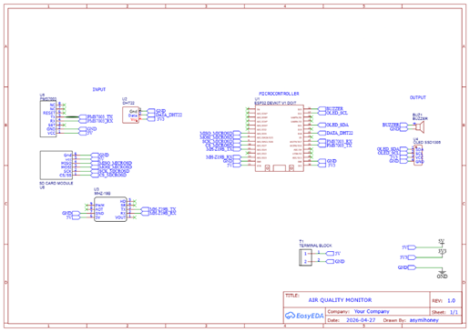
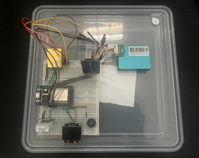
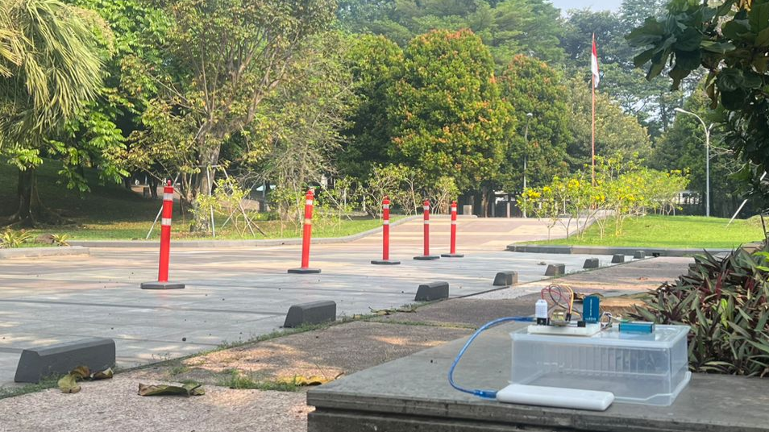

# AsmiAQIOT - An Air Quality Monitor IoT using ESP32

I built this as an IoT prototype to monitor air quality around my campus 
(Universitas Gunadarma, Depok) — tracking CO₂, PM2.5, temperature, and 
humidity in real time using an ESP32 with a set of dedicated sensors. 
It also ended up as the hardware backbone of my bachelor's thesis, where 
I used it to collect field data across several indoor and outdoor spots 
on campus.

The main challenge I wanted to solve wasn't just reading sensor data, 
but keeping that data reliable even when Wi-Fi isn't. So the device 
pushes readings to a cloud dashboard over MQTT whenever it's connected, 
and automatically falls back to logging everything on a Micro SD card 
when it's not — no data lost either way. It also has a local OLED 
display and a buzzer that goes off if CO₂ or PM2.5 crosses a set 
threshold, so there's an immediate warning on-site, not just on the 
dashboard.

This repo covers the full data pipeline — device wiring/schematic, 
ESP32 firmware, and the bridge service that moves data from MQTT into 
the cloud database.

🔗 **Live Dashboard:** https://asmiaqiotdeploy.vercel.app/
<br>
*(Note: hosted on Supabase's free tier — the database may be paused due to inactivity and show no data until manually resumed.)*

## Features
- Real-time CO₂, PM2.5, temperature & humidity monitoring
- Dual-storage: MQTT → Supabase (online) + Micro SD Card CSV (offline fallback)
- Local OLED display with live readings and alarm status
- Buzzer alert when CO₂ or PM2.5 exceeds safety thresholds
- Portable, powered by a 10,000 mAh power bank — no need for a fixed outlet

## Data Flow
- ESP32 (sensors) → MQTT (HiveMQ) → mqtt-bridge (Python subscriber) → Supabase → Web Dashboard
- ESP32 (sensors) → Micro SD Card (offline fallback)

The ESP32 publishes sensor readings as JSON over MQTT. A Python service 
(`mqtt-bridge/`) subscribes to that topic and writes each reading into 
Supabase, which the web dashboard reads from. If Wi-Fi is down, the 
ESP32 skips the MQTT step entirely and just logs to the SD card instead.

## Hardware Components
| Component | Function |
|---|---|
| ESP32 DevKit V1 | Main microcontroller |
| MH-Z19B | CO₂ sensor (NDIR) |
| PMS7003 | PM1.0 / PM2.5 / PM10 sensor |
| DHT22 | Temperature & humidity sensor |
| SSD1306 OLED 0.96" | Local display |
| Micro SD Card Adapter | Local data logging |
| Buzzer 5V | Audible alarm |
| Power Bank 10,000 mAh | Portable power source |

## Wiring / Pinout

| Component | Pin | ESP32 GPIO |
|---|---|---|
| DHT22 | Data | GPIO4 |
| MH-Z19B | RX / TX | GPIO14 / GPIO13 |
| PMS7003 | RX / TX | GPIO16 / GPIO17 |
| SSD1306 OLED | SDA / SCL | GPIO21 / GPIO22 |
| Micro SD Card | CS / SCK / MOSI / MISO | GPIO27 / GPIO26 / GPIO25 / GPIO33 |
| Buzzer | Signal | GPIO23 |

## Schematic


## Assembled Device


I put everything in a transparent plastic case for portability and 
dust protection, then ran it off a power bank so I could move it 
between monitoring spots without worrying about power outlets.

## Field Data Collection


The device deployed on-site during one of the monitoring sessions, 
logging live readings while running independently on battery power.

## Firmware Setup (ESP32)
1. Install required libraries via Arduino IDE Library Manager:
   `DHT sensor library`, `MHZ19`, `PMS`, `Adafruit SSD1306`, `Adafruit GFX`, 
   `PubSubClient`, `ArduinoJson`, `SD`
2. Open `firmware/air_quality_monitor.ino`
3. Fill in your own Wi-Fi and MQTT broker credentials:
```cpp
   const char* ssid       = "YOUR_WIFI_SSID";
   const char* password   = "YOUR_WIFI_PASSWORD";
   const char* mqtt_host  = "YOUR_MQTT_HOST";
   const int   mqtt_port  = 8883;
   const char* mqtt_user  = "YOUR_MQTT_USER";
   const char* mqtt_pass  = "YOUR_MQTT_PASS";
   const char* mqtt_topic = "YOUR_MQTT_TOPIC";
```
4. Upload to ESP32 DevKit V1 via Arduino IDE

## MQTT Bridge Setup (Python → Supabase)
This service listens to the MQTT topic and inserts incoming readings 
into Supabase.

1. Install dependencies:
```bash
   pip install -r mqtt-bridge/requirements.txt
```
2. Fill in your Supabase and MQTT credentials in `mqtt-bridge/mqtt_to_supabase.py`:
```python
   SUPABASE_URL = "YOUR_SUPABASE_URL"
   SUPABASE_KEY = "YOUR_SUPABASE_KEY"

   MQTT_HOST = "YOUR_MQTT_HOST"
   MQTT_PORT = 8883
   MQTT_USER = "YOUR_MQTT_USER"
   MQTT_PASS = "YOUR_MQTT_PASS"
   MQTT_TOPIC = "YOUR_MQTT_TOPIC"
```
3. Run the bridge:
```bash
   python mqtt-bridge/mqtt_to_supabase.py
```

## Alarm Thresholds
- CO₂ > 1000 ppm ([Permenkes No. 48/2016](https://peraturan.bpk.go.id/Details/113097/permenkes-no-48-tahun-2016) — Standar Keselamatan dan Kesehatan Kerja Perkantoran)
- PM2.5 > 150 µg/m³ ([Permen LHK No. P.14/2020](https://peraturan.bpk.go.id/Details/163466/permen-lhk-no-14-tahun-2020) — Indeks Standar Pencemar Udara)